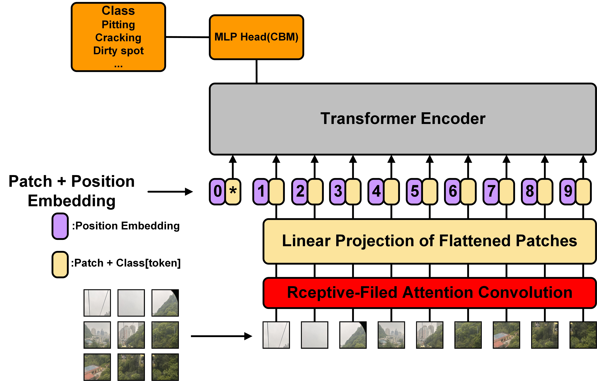
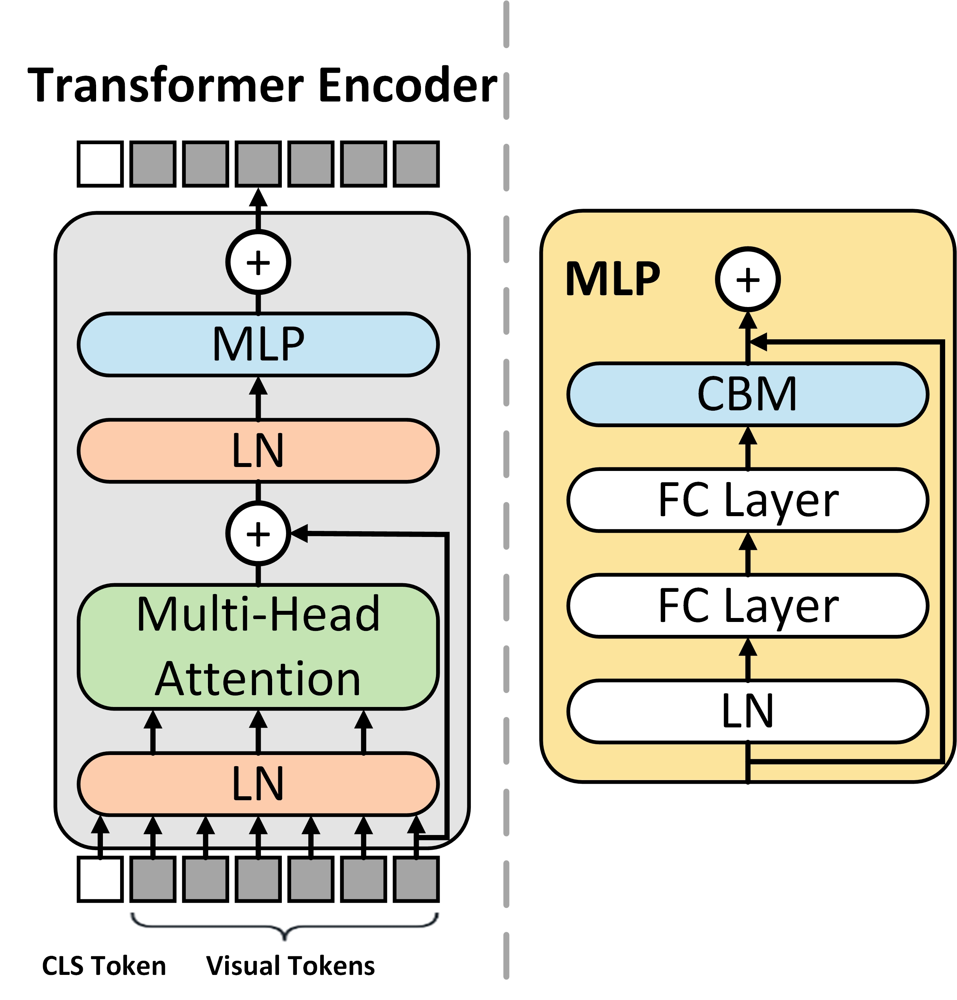
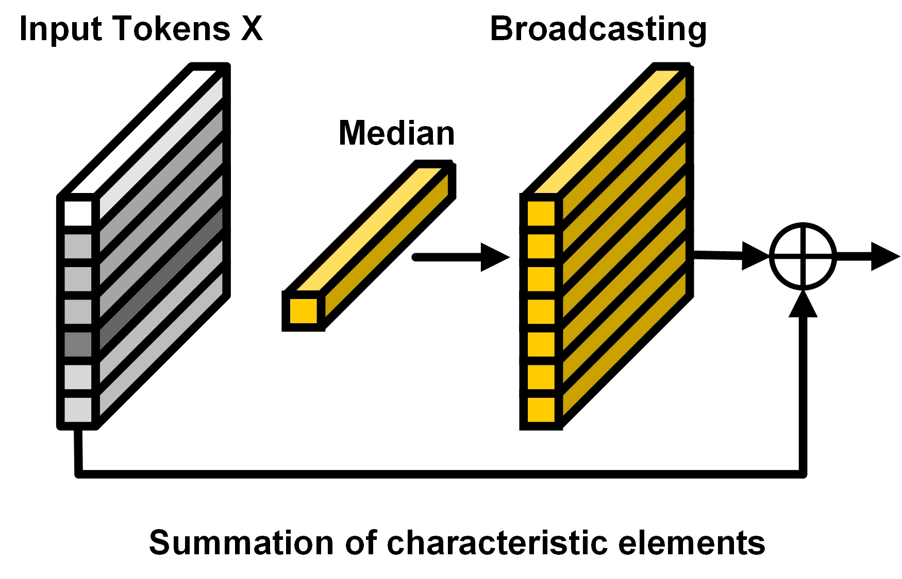
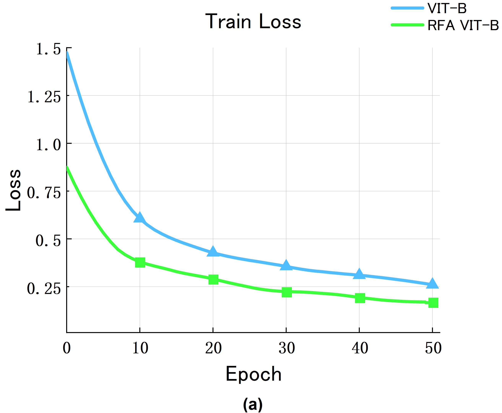
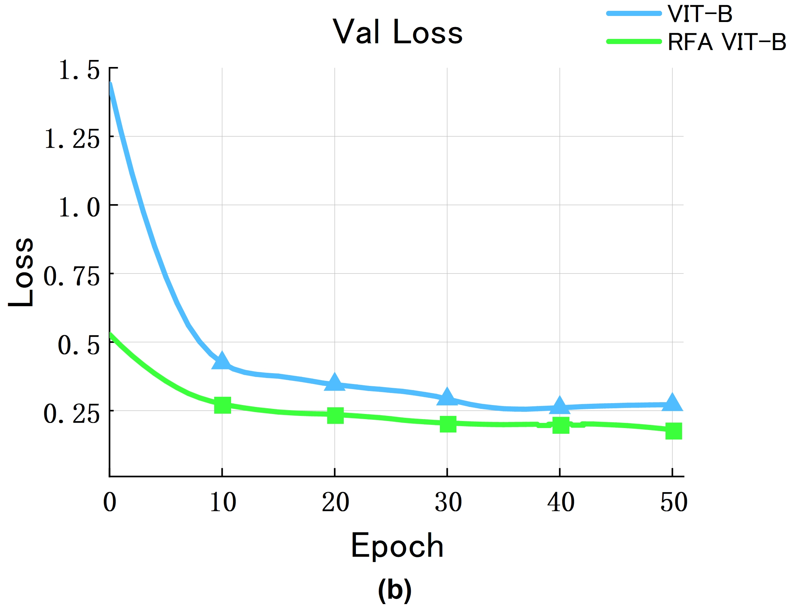
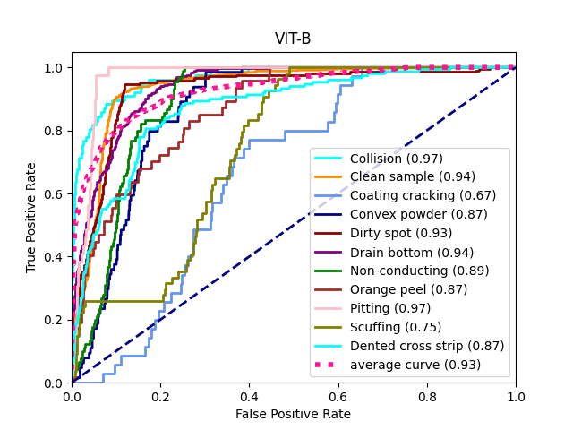
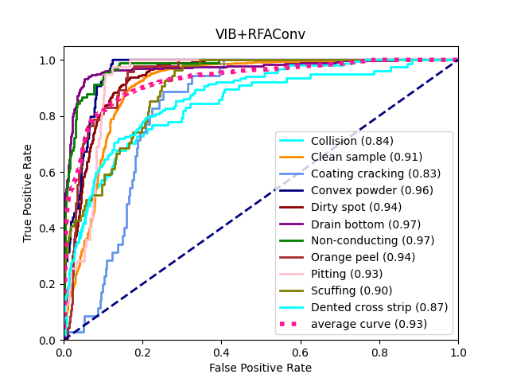

# RFAConv-CBM-ViT: Enhanced Vision Transformer for Metal Surface Defect Detection

This repo contains the official **PyTorch** code for RFAConv-CBM-ViT .

## Introduction

    

    

### Key Features:
- This paper introduces the **Receptive-Field Attention Convolution (RFAConv)** module into the ViT model, re-placing standard convolution operations with a spatial attention mechanism. This allows the model to capture more comprehensive feature information. Experimental results show that applying this module to a full-sized ViT not only enhances the model's fitting ability but also sig-nificantly improves accuracy.
- The paper designs and proposes the **Context Broad-casting Median (CBM)** module, specifically for metal surface defect detection. Extensive ablation experiments demonstrate the superior performance of this module in metal surface defect detection tasks.
- By integrating the advantages of RFAConv and CBM, this paper proposes the **RFAConv-CBM-ViT** model. Comprehensive comparative experiments prove that this model outperforms all benchmark comparison models.

### Method 

#### RFAConvolution

    

RFA can be considered a lightweight, plug-and-play module, with its structure being a fixed convolutional com-bination. RFA relies on the assistance of convolution operations, while convolution operations also benefit from RFA to enhance performance.

 

#### Context Broadcasting Median

    

We design and proposes the Context Broadcasting Median (CBM) module, specifically for metal surface defect de-tection. Extensive ablation experiments demonstrate the superior performance of this module in metal surface defect detection tasks.

 

### High accuracy and fast convergence

 

    
    

RFAConv Module Enhances Model Convergence Speed. (a) The training loss decreases faster with the RFAConv module. (b) The validation loss is lower with the RFAConv module.

 

    
    

ROC Curves Before and After Adding the RFAConv Module. (a) ViT-B model ROC curves. (b) ViT-B with RFAConv module ROC curves.

 

## Dependencies

- Python 3.8
- PyTorch == 1.13.0
- torchvision == 0.12.0
- fvcore == 0.1.5
- numpy
- timm == 0.4.12
- yacs

## Dataset

* aluminum surface defect dataset:

original：https://tianchi.aliyun.com/dataset/140666 
Used in the paper：https://www.kaggle.com/datasets/wehaoreal/aluminum-profile-surface-defects-data-set

* X-SSD hot-rolled steel strip:

https://www.kaggle.com/datasets/sayelabualigah/x-sdd

* nut:

https://uverse.rboflow.com/rocz/nutsqnfzt/dataset/2
