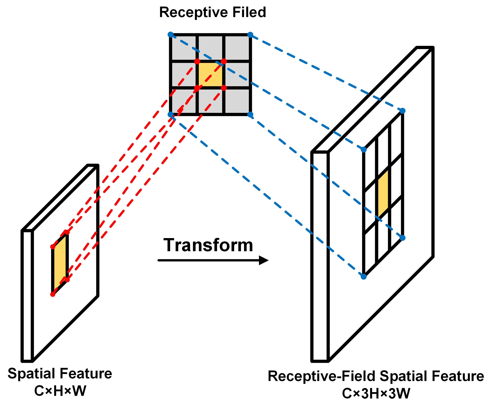

# RFAConv-CBM-ViT: Enhanced Vision Transformer for Metal Surface Defect Detection

This repo contains the official **PyTorch** code for RFAConv-CBM-ViT .

## Introduction

    

### Key Features:
- **Receptive-Field Attention Convolution (RFAConv)**: Enhances feature extraction by expanding the receptive field and applying a spatial attention mechanism.
- **Context Broadcasting Median (CBM)**: Improves model robustness and training efficiency by using median pooling in attention maps, reducing the influence of noise and outliers.
- **High Accuracy**: Demonstrated top-1 classification accuracy of 97.71% on the aluminum surface defect dataset, 99.25% on the X-SSD hot-rolled steel strip surface defect dataset, and 99.27% on the nut surface defect dataset.

### Method 

#### RFAConvolution

    

RFA can be considered a lightweight, plug-and-play module, with its structure being a fixed convolutional com-bination. This paper posits that RFA relies on the assistance of convolution operations, while convolution operations also benefit from RFA to enhance performance. 

#### Context Broadcasting Median

    

We design and proposes the Context Broadcasting Median (CBM) module, specifically for metal surface defect de-tection. Extensive ablation experiments demonstrate the superior performance of this module in metal surface defect detection tasks.

### High accuracy and fast convergence
